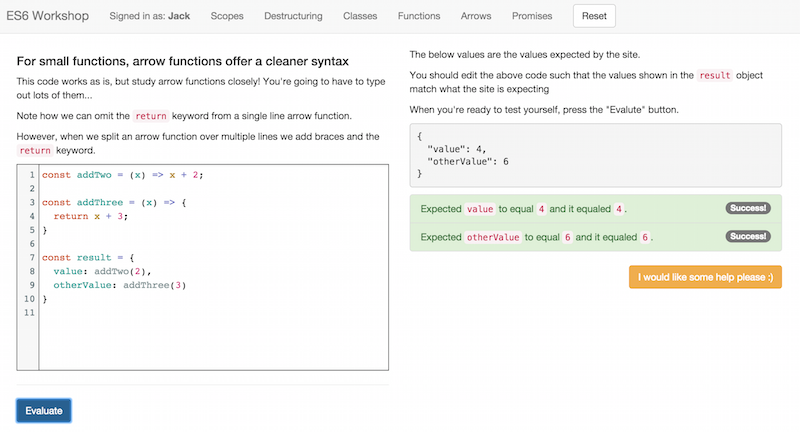

# Interactive ES6 Workshop

An interactive environment for helping people learn ES6, written in ES6 (meta!) and ReactJS.

## Features

- Live code editing and execution in the browser including ES6 support using Babel.
- The expected outcome of code can be defined and the evaluated code is checked against it.
- Users can hit a button to request help, which is sent in realtime with [Pusher](http://pusher.com) to a dashboard.
- The system can either expect code to return a specific value, or a promise that resolves to that value (see the Promises challenges).

## Running Locally

- `npm install`
- `./node_modules/.bin/jspm install`
- `npm start`

## Building for Production

- `make`
- Push the `dist` directory to your server.
